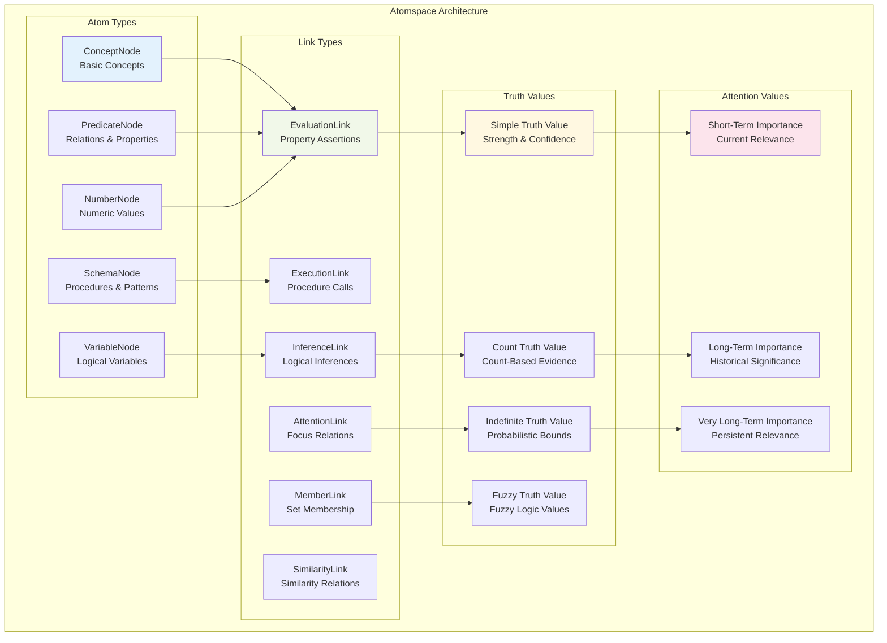
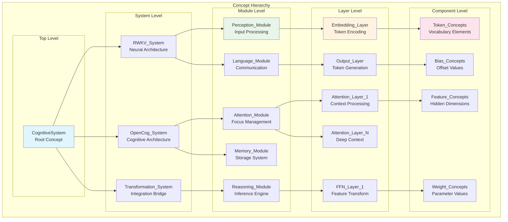
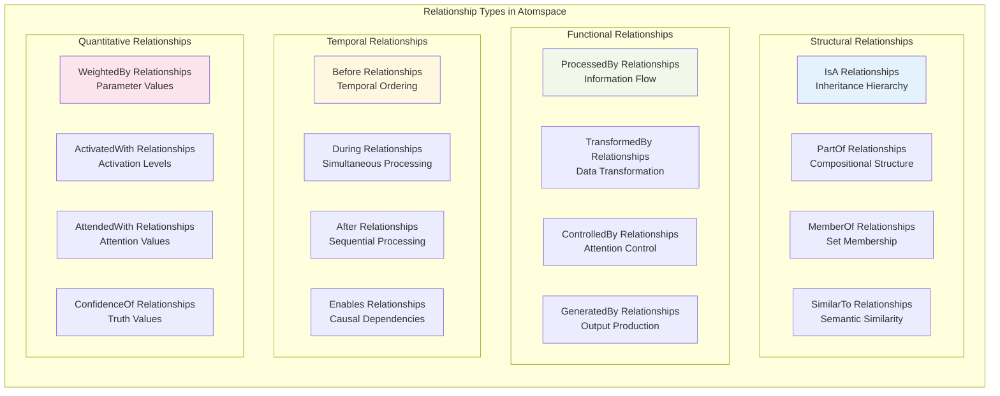
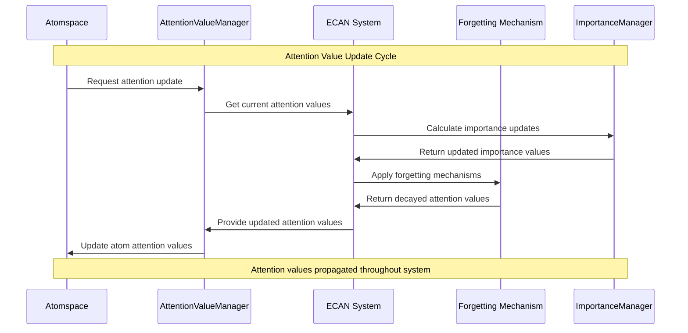
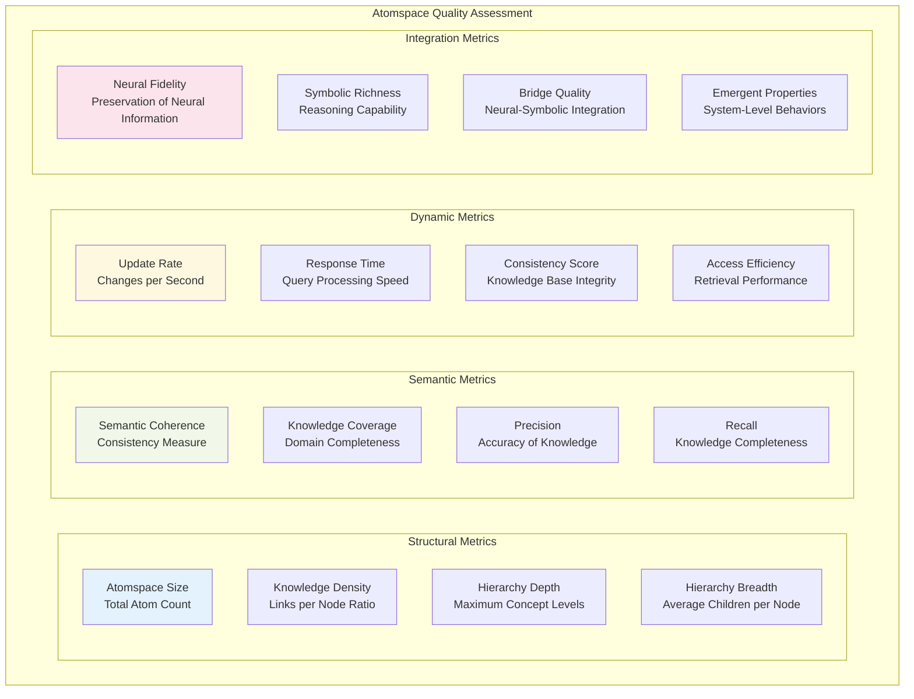

# Atomspace Integration Architecture

This document describes the integration between RWKV neural representations and OpenCog's Atomspace knowledge representation system, detailing how neural model components are transformed into symbolic atoms and relationships.

## 🧭 Atomspace Overview

The Atomspace serves as the central knowledge representation system in OpenCog, providing a unified framework for storing, manipulating, and reasoning over both symbolic and subsymbolic information.



## 🔄 RWKV to Atomspace Transformation

### Neural Component Mapping

The transformation process maps RWKV neural components to specific Atomspace representations:

```mermaid
flowchart TD
    subgraph "RWKV Neural Components"
        subgraph "Model Structure"
            EMB[Embedding Matrix<br/>Token → Vector Mapping]
            ATT_K[Attention Keys<br/>Context Queries]
            ATT_V[Attention Values<br/>Information Content]
            ATT_R[Receptance Gates<br/>Information Filtering]
            FFN_K[FFN Keys<br/>Feature Queries]
            FFN_V[FFN Values<br/>Feature Content]
            OUT[Output Head<br/>Vector → Token Mapping]
        end
        
        subgraph "Learned Parameters"
            WE[Weight Matrices<br/>Transformation Parameters]
            BE[Bias Vectors<br/>Offset Parameters]
            LN[Layer Norms<br/>Normalization Parameters]
        end
    end
    
    subgraph "Atomspace Representations"
        subgraph "Conceptual Atoms"
            TOKEN_CONCEPTS[Token Concepts<br/>ConceptNode("token_X")]
            LAYER_CONCEPTS[Layer Concepts<br/>ConceptNode("layer_N")]
            MODULE_CONCEPTS[Module Concepts<br/>ConceptNode("attention_module")]
            FEATURE_CONCEPTS[Feature Concepts<br/>ConceptNode("feature_dimension")]
        end
        
        subgraph "Relational Atoms"
            EMBED_RELATIONS[Embedding Relations<br/>EvaluationLink(embed, token, vector)]
            ATTENTION_RELATIONS[Attention Relations<br/>AttentionLink(source, target, weight)]
            TRANSFORM_RELATIONS[Transform Relations<br/>InferenceLink(input, output, transform)]
        end
        
        subgraph "Procedural Atoms"
            PROCESSING_SCHEMAS[Processing Schemas<br/>SchemaNode("attention_process")]
            INFERENCE_SCHEMAS[Inference Schemas<br/>SchemaNode("reasoning_step")]
            GENERATION_SCHEMAS[Generation Schemas<br/>SchemaNode("token_generation")]
        end
    end
    
    EMB --> TOKEN_CONCEPTS
    ATT_K --> LAYER_CONCEPTS
    ATT_V --> MODULE_CONCEPTS
    FFN_K --> FEATURE_CONCEPTS
    
    WE --> EMBED_RELATIONS
    BE --> ATTENTION_RELATIONS
    LN --> TRANSFORM_RELATIONS
    
    ATT_R --> PROCESSING_SCHEMAS
    FFN_V --> INFERENCE_SCHEMAS
    OUT --> GENERATION_SCHEMAS
    
    style EMB fill:#e3f2fd
    style TOKEN_CONCEPTS fill:#f1f8e9
    style EMBED_RELATIONS fill:#fff8e1
    style PROCESSING_SCHEMAS fill:#fce4ec
```

### Atomspace Node Generation Process

```python
class AtomspaceNodeGenerator:
    """Generate Atomspace nodes from RWKV neural components"""
    
    def __init__(self, atomspace: AtomSpace):
        self.atomspace = atomspace
        self.node_registry = {}
        self.link_registry = {}
        
    def generate_embedding_atoms(self, embedding_layer: EmbeddingLayer) -> List[Atom]:
        """Generate atoms representing embedding relationships"""
        atoms = []
        
        # Create concept nodes for tokens
        for token_id, token_text in embedding_layer.vocab.items():
            token_concept = ConceptNode(f"token_{token_text}")
            vector_concept = ConceptNode(f"embedding_vector_{token_id}")
            
            # Create embedding relationship
            embedding_relation = EvaluationLink(
                PredicateNode("has_embedding"),
                ListLink(token_concept, vector_concept)
            )
            
            # Add truth value based on embedding norm
            embedding_norm = np.linalg.norm(embedding_layer.weights[token_id])
            normalized_strength = min(1.0, embedding_norm / 10.0)
            embedding_relation.tv = SimpleTruthValue(normalized_strength, 0.9)
            
            atoms.extend([token_concept, vector_concept, embedding_relation])
        
        return atoms
    
    def generate_attention_atoms(self, attention_layer: AttentionLayer) -> List[Atom]:
        """Generate atoms representing attention mechanisms"""
        atoms = []
        
        # Create attention module concept
        attention_module = ConceptNode(f"attention_module_{attention_layer.layer_id}")
        
        # Generate attention relationship atoms
        for source_pos in range(attention_layer.context_length):
            for target_pos in range(attention_layer.context_length):
                if source_pos != target_pos:  # Skip self-attention for simplicity
                    source_concept = ConceptNode(f"position_{source_pos}")
                    target_concept = ConceptNode(f"position_{target_pos}")
                    
                    # Calculate attention weight (simplified)
                    attention_weight = self.calculate_attention_weight(
                        attention_layer, source_pos, target_pos
                    )
                    
                    # Create attention link
                    attention_link = AttentionLink(
                        source_concept, 
                        target_concept,
                        attention_weight
                    )
                    
                    atoms.extend([source_concept, target_concept, attention_link])
        
        return atoms
    
    def generate_reasoning_atoms(self, ffn_layer: FeedForwardLayer) -> List[Atom]:
        """Generate atoms representing reasoning processes"""
        atoms = []
        
        # Create reasoning module concept
        reasoning_module = ConceptNode(f"reasoning_module_{ffn_layer.layer_id}")
        
        # Generate inference relationship atoms
        for input_dim in range(ffn_layer.input_size):
            for output_dim in range(ffn_layer.output_size):
                input_concept = ConceptNode(f"input_feature_{input_dim}")
                output_concept = ConceptNode(f"output_feature_{output_dim}")
                
                # Calculate transformation strength
                weight_strength = abs(ffn_layer.weights[output_dim, input_dim])
                normalized_strength = min(1.0, weight_strength)
                
                # Create inference link
                inference_link = InferenceLink(
                    input_concept,
                    output_concept
                )
                inference_link.tv = SimpleTruthValue(normalized_strength, 0.8)
                
                atoms.extend([input_concept, output_concept, inference_link])
        
        return atoms
```

## 🏗️ Atomspace Knowledge Structures

### Hierarchical Concept Organization



### Knowledge Relationships



## 🎯 Pattern Matching Integration

### Pattern Template Structure

The Atomspace integration enables sophisticated pattern matching for symbolic reasoning:

```scheme
;; Embedding pattern template
(define embedding-pattern
  (EvaluationLink
    (PredicateNode "has_embedding")
    (ListLink
      (VariableNode "$token")
      (VariableNode "$vector"))))

;; Attention pattern template  
(define attention-pattern
  (AttentionLink
    (VariableNode "$source")
    (VariableNode "$target")
    (VariableNode "$weight")))

;; Inference pattern template
(define inference-pattern
  (InferenceLink
    (AndLink
      (ConceptNode "$premise1")
      (ConceptNode "$premise2"))
    (ConceptNode "$conclusion")))

;; Complex reasoning pattern
(define complex-reasoning-pattern
  (ImplicationLink
    (AndLink
      (EvaluationLink
        (PredicateNode "has_feature")
        (ListLink
          (VariableNode "$input")
          (VariableNode "$feature")))
      (EvaluationLink
        (PredicateNode "exceeds_threshold")
        (ListLink
          (VariableNode "$feature")
          (NumberNode 0.7))))
    (EvaluationLink
      (PredicateNode "activate_response")
      (ListLink
        (VariableNode "$input")
        (ConceptNode "positive_response")))))
```

### Pattern Matching Engine Integration

```python
class PatternMatchingEngine:
    """Interface between RWKV transformations and OpenCog pattern matching"""
    
    def __init__(self, atomspace: AtomSpace):
        self.atomspace = atomspace
        self.pattern_library = PatternLibrary()
        self.match_cache = {}
        
    def create_cognitive_patterns(self, cognitive_layer: CognitiveLayer) -> List[Pattern]:
        """Create pattern matching templates for a cognitive layer"""
        patterns = []
        
        if cognitive_layer.module_type == 'perception':
            patterns.extend(self.create_perception_patterns(cognitive_layer))
        elif cognitive_layer.module_type == 'attention':
            patterns.extend(self.create_attention_patterns(cognitive_layer))
        elif cognitive_layer.module_type == 'reasoning':
            patterns.extend(self.create_reasoning_patterns(cognitive_layer))
        elif cognitive_layer.module_type == 'language':
            patterns.extend(self.create_language_patterns(cognitive_layer))
            
        return patterns
    
    def create_perception_patterns(self, layer: CognitiveLayer) -> List[Pattern]:
        """Create patterns for perception processing"""
        patterns = []
        
        # Token recognition pattern
        token_pattern = EvaluationLink(
            PredicateNode("recognize_token"),
            ListLink(
                VariableNode("$input"),
                VariableNode("$token_concept")
            )
        )
        patterns.append(Pattern(token_pattern, "token_recognition"))
        
        # Feature extraction pattern
        feature_pattern = EvaluationLink(
            PredicateNode("extract_features"),
            ListLink(
                VariableNode("$input"),
                SetLink(VariableNode("$features"))
            )
        )
        patterns.append(Pattern(feature_pattern, "feature_extraction"))
        
        return patterns
    
    def execute_pattern_matching(self, query_pattern: Pattern) -> List[MatchResult]:
        """Execute pattern matching query against Atomspace"""
        # Check cache first
        pattern_key = self.pattern_to_key(query_pattern)
        if pattern_key in self.match_cache:
            return self.match_cache[pattern_key]
        
        # Execute pattern matching
        matcher = PatternMatcher(self.atomspace)
        matches = matcher.match(query_pattern)
        
        # Process and cache results
        processed_matches = self.process_matches(matches)
        self.match_cache[pattern_key] = processed_matches
        
        return processed_matches
```

## 💾 Truth Value and Attention Value Management

### Truth Value Systems

```mermaid
graph TB
    subgraph "Truth Value Types"
        subgraph "Simple Truth Values"
            STV[SimpleTruthValue<br/>Strength ∈ [0,1]<br/>Confidence ∈ [0,1]]
        end
        
        subgraph "Count Truth Values"
            CTV[CountTruthValue<br/>Positive Count<br/>Total Count]
        end
        
        subgraph "Indefinite Truth Values"
            ITV[IndefiniteTruthValue<br/>Lower Bound<br/>Upper Bound<br/>Confidence Level]
        end
        
        subgraph "Fuzzy Truth Values"
            FTV[FuzzyTruthValue<br/>Membership Degree<br/>Fuzzy Confidence]
        end
        
        subgraph "Probabilistic Truth Values"
            PTV[ProbabilisticTruthValue<br/>Mean Estimate<br/>Variance Estimate]
        end
    end
    
    subgraph "Truth Value Operations"
        subgraph "Basic Operations"
            REV[Revision<br/>Combine Evidence]
            DED[Deduction<br/>Forward Inference]
            IND[Induction<br/>Generalization]
            ABD[Abduction<br/>Explanation]
        end
        
        subgraph "Fuzzy Operations"
            FAND[Fuzzy AND<br/>Intersection]
            FOR[Fuzzy OR<br/>Union]  
            FNOT[Fuzzy NOT<br/>Complement]
            FIMP[Fuzzy Implication<br/>Material Implication]
        end
        
        subgraph "Probabilistic Operations"
            BAYES[Bayesian Update<br/>Conditional Probability]
            ENTROPY[Entropy Calculation<br/>Information Content]
            MUTUAL[Mutual Information<br/>Dependency Measure]
        end
    end
    
    STV --> REV
    CTV --> DED
    ITV --> IND
    FTV --> FAND
    PTV --> BAYES
    
    style STV fill:#e3f2fd
    style REV fill:#f1f8e9
    style FAND fill:#fff8e1
    style BAYES fill:#fce4ec
```

### Truth Value Assignment Strategy

```python
class TruthValueAssignmentStrategy:
    """Assign truth values to atoms based on neural network parameters"""
    
    def __init__(self):
        self.confidence_threshold = 0.8
        self.strength_normalizer = StandardNormalizer()
        
    def assign_embedding_truth_values(self, token_concept: ConceptNode, 
                                    embedding_vector: np.ndarray) -> SimpleTruthValue:
        """Assign truth values for embedding relationships"""
        # Calculate strength based on embedding norm
        embedding_norm = np.linalg.norm(embedding_vector)
        strength = min(1.0, embedding_norm / 10.0)  # Normalize to [0,1]
        
        # Calculate confidence based on vector consistency
        # (higher confidence for more stable embeddings)
        vector_variance = np.var(embedding_vector)
        confidence = max(0.1, 1.0 - (vector_variance / 10.0))
        
        return SimpleTruthValue(strength, confidence)
    
    def assign_attention_truth_values(self, attention_weight: float, 
                                    context_length: int) -> SimpleTruthValue:
        """Assign truth values for attention relationships"""
        # Normalize attention weight
        strength = min(1.0, max(0.0, attention_weight))
        
        # Confidence based on attention sharpness
        # Higher confidence for more focused attention
        attention_entropy = self.calculate_attention_entropy(attention_weight, context_length)
        confidence = max(0.1, 1.0 - attention_entropy)
        
        return SimpleTruthValue(strength, confidence)
    
    def assign_inference_truth_values(self, weight_matrix: np.ndarray,
                                    input_idx: int, output_idx: int) -> SimpleTruthValue:
        """Assign truth values for inference relationships"""
        weight_value = weight_matrix[output_idx, input_idx]
        
        # Strength based on absolute weight value
        strength = min(1.0, abs(weight_value))
        
        # Confidence based on weight stability across similar connections
        similar_weights = self.get_similar_weights(weight_matrix, input_idx, output_idx)
        weight_variance = np.var(similar_weights)
        confidence = max(0.1, 1.0 - (weight_variance / 5.0))
        
        return SimpleTruthValue(strength, confidence)
```

### Attention Value Management



## 🔄 Dynamic Atomspace Updates

### Incremental Knowledge Updates

```mermaid
flowchart TD
    subgraph "Dynamic Update Process"
        subgraph "Change Detection"
            CD[Change Detection<br/>Monitor Neural Parameters]
            TH[Threshold Analysis<br/>Significance Assessment]
            PR[Priority Ranking<br/>Update Ordering]
        end
        
        subgraph "Atomspace Modification"
            ADD[Add New Atoms<br/>Create Novel Concepts]
            MOD[Modify Existing Atoms<br/>Update Truth Values]
            DEL[Delete Obsolete Atoms<br/>Remove Irrelevant Knowledge]
            LINK[Update Links<br/>Modify Relationships]
        end
        
        subgraph "Consistency Maintenance"
            CON[Consistency Checking<br/>Validate Knowledge Base]
            REP[Repair Conflicts<br/>Resolve Contradictions]
            OPT[Optimization<br/>Improve Efficiency]
        end
        
        subgraph "Knowledge Integration"
            MERGE[Merge Similar Concepts<br/>Consolidate Knowledge]
            ABSTRACT[Abstract Patterns<br/>Discover Generalizations]
            INDEX[Update Indices<br/>Maintain Fast Access]
        end
    end
    
    CD --> TH
    TH --> PR
    PR --> ADD
    
    ADD --> MOD
    MOD --> DEL
    DEL --> LINK
    
    LINK --> CON
    CON --> REP
    REP --> OPT
    
    OPT --> MERGE
    MERGE --> ABSTRACT
    ABSTRACT --> INDEX
    
    INDEX --> CD
    
    style CD fill:#e3f2fd
    style ADD fill:#f1f8e9
    style CON fill:#fff8e1
    style MERGE fill:#fce4ec
```



### Knowledge Base Maintenance

```python
class AtomspaceMaintenanceSystem:
    """Maintain Atomspace consistency and performance during updates"""
    
    def __init__(self, atomspace: AtomSpace):
        self.atomspace = atomspace
        self.update_queue = UpdateQueue()
        self.consistency_checker = ConsistencyChecker()
        self.performance_monitor = PerformanceMonitor()
        
    def process_neural_updates(self, neural_changes: List[NeuralChange]):
        """Process updates from neural network parameter changes"""
        # Filter significant changes
        significant_changes = self.filter_significant_changes(neural_changes)
        
        # Group related changes
        change_groups = self.group_related_changes(significant_changes)
        
        # Process each group
        for group in change_groups:
            self.process_change_group(group)
    
    def process_change_group(self, change_group: ChangeGroup):
        """Process a group of related changes atomically"""
        with self.atomspace.transaction():
            try:
                # Apply changes
                for change in change_group.changes:
                    self.apply_single_change(change)
                
                # Validate consistency
                if not self.consistency_checker.validate_changes(change_group):
                    raise ConsistencyError("Changes violate knowledge base consistency")
                
                # Update derived knowledge
                self.update_derived_knowledge(change_group)
                
                # Commit transaction
                return True
                
            except Exception as e:
                # Rollback on error
                print(f"Error processing change group: {e}")
                return False
    
    def maintain_performance(self):
        """Maintain Atomspace performance through optimization"""
        # Garbage collection for unused atoms
        self.garbage_collect_atoms()
        
        # Optimize attention value distribution
        self.optimize_attention_distribution()
        
        # Update access indices
        self.update_access_indices()
        
        # Compress redundant knowledge
        self.compress_redundant_knowledge()
    
    def garbage_collect_atoms(self):
        """Remove atoms with very low long-term importance"""
        atoms_to_remove = []
        
        for atom in self.atomspace.get_atoms_by_type(ATOM):
            lti = atom.attention_value.lti
            if lti < self.lti_threshold and not self.is_essential_atom(atom):
                atoms_to_remove.append(atom)
        
        # Remove atoms in batches
        for atom in atoms_to_remove:
            self.atomspace.remove_atom(atom)
```

## 📊 Integration Performance Metrics

### Atomspace Quality Metrics



This comprehensive Atomspace integration provides a robust foundation for bridging neural and symbolic representations, enabling sophisticated reasoning capabilities while preserving the computational benefits of the original RWKV architecture.