# Attention Network Architecture

This document details the attention network design in RWKV-Raven-Cog, explaining how attention mechanisms are transformed from RWKV's neural attention to OpenCog's cognitive attention allocation system.

## 🎯 Attention Network Overview

The attention network serves as the cognitive resource management system, dynamically allocating processing resources across different cognitive modules based on their importance, current activation, and task demands.


## 🔄 RWKV to OpenCog Attention Transformation

### Neural Attention Mechanisms (RWKV)

RWKV implements attention through three key components: Receptance (R), Weight (W), and Key-Value (K,V) mechanisms.

```mermaid
graph LR
    subgraph "RWKV Attention Mechanism"
        subgraph "Input Processing"
            X[Input Sequence<br/>x₁, x₂, ..., xₜ]
            R[Receptance<br/>R = σ(Wᵣ × x)]
            K[Key<br/>K = Wₖ × x]
            V[Value<br/>V = Wᵥ × x]
        end
        
        subgraph "Time-Mix Processing"
            TM[Time-Mix<br/>Temporal Integration]
            W[Learned Weights<br/>Position-Dependent]
            WKV[Weighted Key-Value<br/>Context Integration]
        end
        
        subgraph "Output Generation"
            ATT_OUT[Attention Output<br/>Contextual Representation]
            GATE[Gating Mechanism<br/>Information Filtering]
            FINAL[Final Output<br/>Processed Information]
        end
    end
    
    X --> R
    X --> K
    X --> V
    
    R --> TM
    K --> W
    V --> WKV
    
    TM --> ATT_OUT
    W --> GATE
    WKV --> FINAL
    
    ATT_OUT --> FINAL
    GATE --> FINAL
    
    style X fill:#e3f2fd
    style TM fill:#f1f8e9
    style ATT_OUT fill:#fff8e1
    style FINAL fill:#fce4ec
```

### Cognitive Attention Transformation

The RWKV attention mechanisms are transformed into cognitive attention structures:


## 🧠 Cognitive Attention Architecture

### Attention Value Calculation

The cognitive attention system uses a multi-factor approach to calculate attention values:

```python
def calculate_cognitive_attention(self, module: CognitiveModule, 
                                context: AttentionContext) -> float:
    """
    Calculate cognitive attention value for a module
    """
    # Base attention by module type
    base_attention = self.get_base_attention(module.module_type)
    
    # Current activation level
    activation_factor = module.get_activation_level()
    
    # Task relevance
    task_relevance = self.calculate_task_relevance(module, context.current_task)
    
    # Resource availability  
    resource_factor = self.get_resource_availability(module)
    
    # Temporal dynamics
    temporal_factor = self.calculate_temporal_dynamics(module, context.time_step)
    
    # Goal alignment
    goal_alignment = self.calculate_goal_alignment(module, context.current_goals)
    
    # Combine factors
    attention_value = (
        base_attention * 0.3 +
        activation_factor * 0.2 +
        task_relevance * 0.2 +
        resource_factor * 0.1 +
        temporal_factor * 0.1 +
        goal_alignment * 0.1
    )
    
    # Apply constraints
    return max(0.0, min(1.0, attention_value))
```

### Attention Allocation Matrix

```mermaid
graph TB
    subgraph "Attention Allocation Matrix"
        subgraph "Rows: Source Modules"
            P[Perception<br/>0.8 base attention]
            A[Attention<br/>0.9 base attention]
            R[Reasoning<br/>0.7 base attention]  
            L[Language<br/>0.8 base attention]
            M[Memory<br/>0.6 base attention]
            E[Emotion<br/>0.5 base attention]
        end
        
        subgraph "Columns: Target Modules"
            TP[→ Perception]
            TA[→ Attention]
            TR[→ Reasoning]
            TL[→ Language]
            TM[→ Memory]
            TE[→ Emotion]
        end
        
        subgraph "Allocation Values"
            V11[P→P: 0.9<br/>Self-Attention]
            V12[P→A: 0.7<br/>Attention Request]
            V13[P→R: 0.6<br/>Reasoning Input]
            V21[A→P: 0.8<br/>Focus Direction]
            V22[A→A: 1.0<br/>Meta-Attention]
            V23[A→R: 0.7<br/>Reasoning Focus]
            V31[R→P: 0.5<br/>Feedback]
            V32[R→A: 0.6<br/>Attention Update]
            V33[R→R: 0.8<br/>Self-Reasoning]
        end
    end
    
    P --> V11
    P --> V12
    P --> V13
    A --> V21
    A --> V22
    A --> V23
    R --> V31
    R --> V32
    R --> V33
    
    V11 --> TP
    V12 --> TA
    V13 --> TR
    V21 --> TP
    V22 --> TA
    V23 --> TR
    V31 --> TP
    V32 --> TA
    V33 --> TR
    
    style P fill:#e8f5e8
    style A fill:#fff3e0
    style R fill:#fce4ec
    style V22 fill:#ffeb3b
```



## 🎛️ Attention Control Mechanisms

### 1. Top-Down Attention Control

**Purpose**: Goal-driven attention allocation based on current tasks and objectives.


**Implementation**:
```python
class TopDownAttentionController:
    """Goal-driven attention control system"""
    
    def __init__(self, goal_system: GoalSystem):
        self.goal_system = goal_system
        self.attention_policies = {}
        self.current_allocations = {}
        
    def allocate_goal_based_attention(self, goals: List[Goal]) -> Dict[str, float]:
        """Allocate attention based on current goals"""
        attention_map = {}
        
        for goal in goals:
            # Determine relevant modules for this goal
            relevant_modules = self.identify_relevant_modules(goal)
            
            # Calculate attention weights based on goal priority and module relevance
            for module_name in relevant_modules:
                base_weight = self.get_module_relevance(module_name, goal)
                goal_priority = goal.priority
                urgency_factor = self.calculate_urgency(goal)
                
                attention_weight = base_weight * goal_priority * urgency_factor
                attention_map[module_name] = attention_map.get(module_name, 0) + attention_weight
        
        # Normalize attention values
        total_attention = sum(attention_map.values())
        if total_attention > 0:
            for module_name in attention_map:
                attention_map[module_name] /= total_attention
                
        return attention_map
```

### 2. Bottom-Up Attention Control

**Purpose**: Stimulus-driven attention capture based on salient environmental features.


### 3. Meta-Attention Control

**Purpose**: Monitor and control the attention system itself, managing attention to attention.

```python
class MetaAttentionController:
    """Control system for managing attention to attention"""
    
    def __init__(self):
        self.attention_history = []
        self.attention_patterns = {}
        self.meta_attention_threshold = 0.7
        
    def monitor_attention_effectiveness(self) -> float:
        """Monitor how effectively attention is being allocated"""
        recent_performance = self.calculate_recent_performance()
        attention_stability = self.calculate_attention_stability()
        resource_utilization = self.calculate_resource_utilization()
        
        effectiveness = (
            recent_performance * 0.4 +
            attention_stability * 0.3 +
            resource_utilization * 0.3
        )
        
        if effectiveness < self.meta_attention_threshold:
            self.trigger_attention_reallocation()
            
        return effectiveness
    
    def detect_attention_patterns(self) -> Dict[str, Any]:
        """Detect patterns in attention allocation over time"""
        patterns = {
            'oscillations': self.detect_oscillations(),
            'persistent_bias': self.detect_bias(),
            'inefficient_switching': self.detect_inefficient_switching(),
            'resource_waste': self.detect_resource_waste()
        }
        
        return patterns
```

## 📊 Attention Dynamics and Temporal Evolution

### Attention State Evolution


### Attention Temporal Dynamics


## 🔗 Attention Network Connectivity

### Network Topology


### Connectivity Patterns

```python
class AttentionNetworkTopology:
    """Manage attention network connectivity and topology"""
    
    def __init__(self):
        self.nodes = {}
        self.edges = {}
        self.connectivity_matrix = np.zeros((0, 0))
        
    def calculate_network_metrics(self) -> Dict[str, float]:
        """Calculate key network topology metrics"""
        return {
            'clustering_coefficient': self.calculate_clustering(),
            'path_length': self.calculate_average_path_length(),
            'centrality_distribution': self.calculate_centrality_distribution(),
            'small_world_coefficient': self.calculate_small_world_coefficient(),
            'network_efficiency': self.calculate_network_efficiency(),
            'robustness': self.calculate_network_robustness()
        }
    
    def identify_attention_hubs(self) -> List[str]:
        """Identify highly connected attention nodes"""
        degree_centrality = self.calculate_degree_centrality()
        betweenness_centrality = self.calculate_betweenness_centrality()
        
        # Combine centrality measures
        hub_scores = {}
        for node in self.nodes:
            hub_scores[node] = (
                degree_centrality[node] * 0.6 +
                betweenness_centrality[node] * 0.4
            )
        
        # Return top hub nodes
        sorted_nodes = sorted(hub_scores.items(), key=lambda x: x[1], reverse=True)
        return [node for node, score in sorted_nodes[:3]]
    
    def optimize_network_topology(self):
        """Optimize network structure for efficient attention flow"""
        # Identify bottlenecks
        bottlenecks = self.identify_bottlenecks()
        
        # Add bypass connections
        for bottleneck in bottlenecks:
            self.add_bypass_connections(bottleneck)
        
        # Remove redundant connections
        redundant_edges = self.identify_redundant_edges()
        for edge in redundant_edges:
            self.remove_edge(edge)
        
        # Rebalance connection weights
        self.rebalance_connection_weights()
```

## 🎯 Attention Allocation Strategies

### Strategy Selection Framework


### Adaptive Allocation Algorithm

```python
class AdaptiveAttentionAllocator:
    """Dynamic attention allocation with learning and adaptation"""
    
    def __init__(self):
        self.allocation_history = []
        self.performance_history = []
        self.strategy_effectiveness = {}
        self.learning_rate = 0.1
        
    def allocate_attention(self, context: AttentionContext) -> Dict[str, float]:
        """Main attention allocation method"""
        # Analyze current context
        context_features = self.analyze_context(context)
        
        # Predict optimal strategy
        predicted_strategy = self.predict_optimal_strategy(context_features)
        
        # Execute allocation
        allocation = self.execute_strategy(predicted_strategy, context)
        
        # Monitor and learn
        self.monitor_allocation_performance(allocation, context)
        
        return allocation
    
    def predict_optimal_strategy(self, context_features: Dict[str, float]) -> str:
        """Predict the best attention allocation strategy"""
        strategy_scores = {}
        
        for strategy_name, strategy_model in self.strategy_models.items():
            score = strategy_model.predict(context_features)
            strategy_scores[strategy_name] = score
        
        # Select highest scoring strategy
        best_strategy = max(strategy_scores.items(), key=lambda x: x[1])
        return best_strategy[0]
    
    def adapt_strategies(self, feedback: PerformanceFeedback):
        """Adapt allocation strategies based on performance feedback"""
        # Update strategy effectiveness scores
        for strategy_name in self.strategy_effectiveness:
            if strategy_name in feedback.used_strategies:
                # Update based on actual performance
                current_score = self.strategy_effectiveness[strategy_name]
                performance_score = feedback.performance_scores[strategy_name]
                
                # Apply learning rate
                updated_score = (
                    current_score * (1 - self.learning_rate) +
                    performance_score * self.learning_rate
                )
                
                self.strategy_effectiveness[strategy_name] = updated_score
        
        # Adjust strategy parameters
        self.adjust_strategy_parameters(feedback)
```

## 📈 Attention Performance Metrics

### Attention Quality Measures


### Performance Assessment Framework

```python
class AttentionPerformanceAssessment:
    """Comprehensive attention performance evaluation system"""
    
    def __init__(self):
        self.metrics_calculator = AttentionMetricsCalculator()
        self.baseline_performance = {}
        self.performance_trends = {}
        
    def assess_attention_system(self, attention_network: AttentionNetwork, 
                              evaluation_period: TimeRange) -> PerformanceReport:
        """Comprehensive attention system assessment"""
        
        # Calculate core metrics
        efficiency_metrics = self.calculate_efficiency_metrics(attention_network, evaluation_period)
        effectiveness_metrics = self.calculate_effectiveness_metrics(attention_network, evaluation_period)
        stability_metrics = self.calculate_stability_metrics(attention_network, evaluation_period)
        adaptive_metrics = self.calculate_adaptive_metrics(attention_network, evaluation_period)
        
        # Generate performance report
        report = PerformanceReport(
            efficiency=efficiency_metrics,
            effectiveness=effectiveness_metrics,
            stability=stability_metrics,
            adaptiveness=adaptive_metrics,
            overall_score=self.calculate_overall_score(
                efficiency_metrics, effectiveness_metrics,
                stability_metrics, adaptive_metrics
            ),
            recommendations=self.generate_recommendations(
                efficiency_metrics, effectiveness_metrics,
                stability_metrics, adaptive_metrics
            )
        )
        
        return report
    
    def identify_performance_bottlenecks(self, attention_network: AttentionNetwork) -> List[Bottleneck]:
        """Identify performance bottlenecks in the attention system"""
        bottlenecks = []
        
        # Analyze attention flow rates
        flow_bottlenecks = self.analyze_attention_flow_bottlenecks(attention_network)
        bottlenecks.extend(flow_bottlenecks)
        
        # Analyze resource utilization
        resource_bottlenecks = self.analyze_resource_bottlenecks(attention_network)
        bottlenecks.extend(resource_bottlenecks)
        
        # Analyze communication delays
        communication_bottlenecks = self.analyze_communication_bottlenecks(attention_network)
        bottlenecks.extend(communication_bottlenecks)
        
        return bottlenecks
```

This attention network architecture provides a sophisticated foundation for managing cognitive resources in the transformed RWKV-OpenCog system, enabling dynamic, adaptive, and efficient allocation of processing resources based on task demands, environmental changes, and system performance.