# Cognitive Layer Architecture

This document provides an in-depth analysis of the cognitive layer architecture used in RWKV-Raven-Cog, detailing how neural network components are transformed into structured cognitive modules that integrate with OpenCog's symbolic reasoning framework.

## 🧠 Cognitive Architecture Overview

The cognitive layer architecture bridges the gap between subsymbolic neural processing and symbolic cognitive reasoning by organizing RWKV model components into functionally-specialized cognitive modules.


## 🏗️ Cognitive Module Types

### 1. Perception Module

**Purpose**: Transforms external inputs into internal cognitive representations that can be processed by higher-level cognitive functions.


**Key Components**:
- **Word Embeddings**: Convert discrete tokens into continuous vector representations
- **Feature Extractors**: Identify salient features from input patterns
- **Concept Generators**: Create symbolic concept nodes from neural activations
- **Semantic Mappers**: Establish relationships between perceptual concepts

**Pattern Templates**:
```scheme
;; Word perception
(EvaluationLink
  (PredicateNode "perceive_word")
  (ListLink
    (ConceptNode $word)
    (NumberNode $embedding_vector)))

;; Concept recognition  
(EvaluationLink
  (PredicateNode "recognize_concept")
  (ListLink
    (ConceptNode $input_pattern)
    (ConceptNode $recognized_concept)
    (NumberNode $confidence)))

;; Feature extraction
(EvaluationLink
  (PredicateNode "extract_features")
  (ListLink
    (ConceptNode $raw_input)
    (SetLink $extracted_features)))
```

### 2. Attention Module

**Purpose**: Manages cognitive focus and resource allocation, determining what information receives processing priority at any given moment.


**Attention Mechanisms**:

1. **Receptance Mechanism**: Determines how much attention to pay to current input
2. **Key-Value Attention**: Identifies important contextual information  
3. **Multi-Head Processing**: Parallel attention computation for different aspects
4. **Temporal Integration**: Combines attention across time steps

**Pattern Templates**:
```scheme
;; Attention allocation
(AttentionLink
  (ConceptNode $source_concept)  
  (ConceptNode $target_concept)
  (NumberNode $attention_weight))

;; Focus management
(EvaluationLink
  (PredicateNode "focus_attention")
  (ListLink
    (ConceptNode $attention_target)
    (NumberNode $focus_strength)
    (ConceptNode $attention_type)))

;; Context integration
(EvaluationLink  
  (PredicateNode "integrate_context")
  (ListLink
    (ConceptNode $current_focus)
    (SetLink $contextual_information)
    (ConceptNode $integrated_representation)))
```

### 3. Working Memory Module

**Purpose**: Provides temporary storage and manipulation of information during cognitive processing, bridging perception and reasoning.


**Components**:
- **Buffer System**: Temporary storage with limited capacity
- **Activation Tracker**: Monitors information relevance and decay
- **Rehearsal Mechanism**: Maintains important information
- **Interference Handler**: Manages competing information

### 4. Reasoning Module

**Purpose**: Performs logical inference, pattern recognition, and symbolic manipulation using the transformed feed-forward network components.


**Reasoning Patterns**:
```scheme
;; Logical inference
(InferenceLink
  (AndLink
    (ConceptNode $premise1)
    (ConceptNode $premise2))
  (ConceptNode $conclusion)
  (NumberNode $confidence_value))

;; Pattern-based reasoning
(EvaluationLink
  (PredicateNode "matches_pattern")
  (ListLink
    (ConceptNode $input_situation)
    (SchemaNode $reasoning_pattern)
    (ConceptNode $derived_conclusion)))

;; Causal reasoning
(EvaluationLink
  (PredicateNode "causes")
  (ListLink
    (ConceptNode $cause_event)
    (ConceptNode $effect_event)
    (NumberNode $causal_strength)))
```

### 5. Language Module

**Purpose**: Handles language comprehension and generation, transforming between internal cognitive representations and external linguistic expressions.

```mermaid
flowchart TD
    subgraph "Language Module Pipeline"
        subgraph "Comprehension Path"
            LC[Language Comprehension<br/>Input Processing]
            SP[Syntactic Parser<br/>Grammar Analysis]
            SEM[Semantic Analyzer<br/>Meaning Extraction]  
            PRAG[Pragmatic Processor<br/>Context Integration]
        end
        
        subgraph "Generation Path"
            IG[Intent Generator<br/>Communication Goals]
            CP[Content Planner<br/>Message Structure]
            LR[Linguistic Realizer<br/>Surface Form]
            PO[Prosody & Output<br/>Final Production]
        end
        
        subgraph "Shared Resources"
            LEX[Lexicon<br/>Word Knowledge]
            GRAM[Grammar Rules<br/>Syntactic Constraints]
            DISC[Discourse Model<br/>Conversation Context]
        end
        
        subgraph "Interface Layer"
            SYM[Symbolic Interface<br/>Concept ↔ Language]
            TOK[Token Generator<br/>Word Production]
        end
    end
    
    LC --> SP
    SP --> SEM
    SEM --> PRAG
    
    IG --> CP
    CP --> LR
    LR --> PO
    
    SP --> GRAM
    SEM --> LEX
    PRAG --> DISC
    CP --> GRAM
    LR --> LEX
    
    PRAG --> SYM
    IG --> SYM
    SYM --> TOK
    
    style LC fill:#e3f2fd
    style IG fill:#f1f8e9
    style SYM fill:#fff8e1
    style TOK fill:#fce4ec
```



**Language Processing Patterns**:
```scheme
;; Token generation
(ExecutionLink
  (SchemaNode "generate_token")
  (ListLink
    (ConceptNode $context_representation)
    (ConceptNode $communication_intent)
    (ConceptNode $generated_token)))

;; Semantic interpretation
(EvaluationLink
  (PredicateNode "semantic_meaning")
  (ListLink
    (ConceptNode $linguistic_expression)
    (ConceptNode $semantic_representation)
    (NumberNode $interpretation_confidence)))

;; Syntactic analysis
(EvaluationLink
  (PredicateNode "syntactic_structure")
  (ListLink
    (ConceptNode $sentence)
    (ConceptNode $parse_tree)
    (ConceptNode $grammatical_relations)))
```

### 6. Long-Term Memory Module

**Purpose**: Provides persistent storage and retrieval of knowledge, experiences, and learned patterns.


### 7. Emotion Module

**Purpose**: Processes affective information and influences cognitive processing through emotional coloring and motivation.


## 🔄 Inter-Module Communication

### Communication Protocols


### Message Passing Framework
```python
class CognitiveMessage:
    """Standard message format for inter-module communication"""
    def __init__(self, sender: str, receiver: str, message_type: str, 
                 content: Dict[str, Any], priority: float = 0.5):
        self.sender = sender
        self.receiver = receiver 
        self.message_type = message_type
        self.content = content
        self.priority = priority
        self.timestamp = datetime.utcnow()
        
class MessageBus:
    """Central communication hub for cognitive modules"""
    def __init__(self):
        self.subscribers = defaultdict(list)
        self.message_queue = PriorityQueue()
        
    def subscribe(self, module: str, message_types: List[str]):
        """Subscribe module to specific message types"""
        for msg_type in message_types:
            self.subscribers[msg_type].append(module)
    
    def publish(self, message: CognitiveMessage):
        """Publish message to subscribed modules"""
        for subscriber in self.subscribers[message.message_type]:
            self.message_queue.put((message.priority, message))
    
    def process_messages(self):
        """Process queued messages by priority"""
        while not self.message_queue.empty():
            priority, message = self.message_queue.get()
            self._deliver_message(message)
```

## 📊 Cognitive Layer Metrics

### Performance Indicators


### Quality Assessment Framework
```python
class CognitiveLayerMetrics:
    """Comprehensive metrics for cognitive layer assessment"""
    
    def __init__(self, layer: CognitiveLayer):
        self.layer = layer
        self.metrics_history = []
        
    def calculate_processing_efficiency(self) -> float:
        """Calculate layer processing efficiency"""
        # Consider processing time, memory usage, throughput
        time_efficiency = 1.0 / (self.layer.avg_processing_time + 0.001)
        memory_efficiency = 1.0 / (self.layer.memory_usage + 1)
        throughput_score = self.layer.operations_per_second / 1000.0
        
        return (time_efficiency + memory_efficiency + throughput_score) / 3.0
    
    def assess_symbolic_integration(self) -> float:
        """Assess quality of symbolic integration"""
        pattern_coverage = len(self.layer.pattern_templates) / 10.0
        atom_connectivity = self._calculate_atom_connectivity()
        truth_value_consistency = self._assess_truth_values()
        
        return (pattern_coverage + atom_connectivity + truth_value_consistency) / 3.0
    
    def evaluate_attention_dynamics(self) -> Dict[str, float]:
        """Evaluate attention-related metrics"""
        return {
            'attention_stability': self._calculate_attention_stability(),
            'attention_responsiveness': self._calculate_attention_response(),
            'attention_efficiency': self._calculate_attention_efficiency()
        }
```

## 🎯 Optimization Strategies

### Layer-Specific Optimizations

#### Perception Module Optimizations
- **Embedding Compression**: Reduce dimensionality while preserving semantic relationships
- **Hierarchical Processing**: Multi-scale feature extraction
- **Attention-Guided Perception**: Focus on salient input regions

#### Attention Module Optimizations  
- **Sparse Attention**: Reduce computational complexity through sparsity
- **Hierarchical Attention**: Multi-level focus management
- **Dynamic Attention**: Adaptive attention based on cognitive load

#### Reasoning Module Optimizations
- **Pattern Caching**: Store frequently used inference patterns
- **Parallel Reasoning**: Concurrent processing of independent inferences  
- **Incremental Learning**: Update reasoning patterns based on experience

#### Language Module Optimizations
- **Contextual Caching**: Reuse linguistic contexts across similar situations
- **Beam Search Optimization**: Efficient search for optimal expressions
- **Semantic Compression**: Compact representation of semantic content

### System-Level Optimizations


This cognitive layer architecture provides a robust foundation for transforming neural language models into structured cognitive systems that can perform both subsymbolic processing and symbolic reasoning, enabling new research directions in artificial general intelligence and cognitive computing.