# Transformation Pipeline Architecture

This document details the step-by-step transformation pipeline that converts RWKV-4-Raven models into OpenCog-compatible cognitive architectures.

## 🔄 Pipeline Overview

The transformation pipeline consists of seven main stages, each responsible for a specific aspect of the RWKV-to-OpenCog conversion process.


## 📋 Stage 1: Model Loading

### Purpose
Load and validate the RWKV-4-Raven model, ensuring compatibility and extracting the necessary components for transformation.

### Process Flow


### Implementation Details
```python
def load_rwkv_model(self, model_path: str) -> Dict[str, Any]:
    """
    Load RWKV model with comprehensive error handling
    """
    model_file = Path(model_path)
    
    # Check file existence
    if not model_file.exists():
        logger.warning(f"Model file not found: {model_path}")
        return self._create_mock_model_structure()
    
    try:
        # Load PyTorch model
        if model_file.suffix == '.pth':
            model_dict = torch.load(model_path, map_location='cpu')
            
            # Validate required components
            required_keys = ['emb', 'blocks', 'ln_out', 'head']
            if not all(key in model_dict for key in required_keys):
                raise ValueError("Invalid RWKV model structure")
                
            return model_dict
            
    except Exception as e:
        logger.error(f"Failed to load model: {e}")
        return self._create_mock_model_structure()
```

### Expected Outputs
- Validated RWKV model state dictionary
- Component inventory (embedding, blocks, normalization, head)
- Dimensional information for each component
- Error status and fallback indicators

## 📊 Stage 2: Layer Analysis

### Purpose
Analyze the loaded RWKV model structure to understand the architecture and extract metadata needed for cognitive mapping.

### RWKV Model Structure Analysis

```mermaid
graph TB
    subgraph "RWKV-4-Raven Architecture"
        EMB[Embedding Layer<br/>vocab_size × hidden_size]
        
        subgraph "Transformer Blocks (×24)"
            LN1[Layer Norm 1]
            ATT[Attention Mechanism]
            ATT_K[Key Projection]
            ATT_V[Value Projection]  
            ATT_R[Receptance Projection]
            ATT_O[Output Projection]
            
            LN2[Layer Norm 2]
            FFN[Feed Forward Network]
            FFN_K[Key Projection]
            FFN_V[Value Projection]
            FFN_R[Receptance Projection]
        end
        
        LN_OUT[Final Layer Norm]
        HEAD[Output Head<br/>hidden_size × vocab_size]
    end
    
    EMB --> LN1
    LN1 --> ATT
    ATT --> ATT_K
    ATT --> ATT_V
    ATT --> ATT_R
    ATT_K --> ATT_O
    ATT_V --> ATT_O
    ATT_R --> ATT_O
    
    ATT_O --> LN2
    LN2 --> FFN
    FFN --> FFN_K
    FFN --> FFN_V
    FFN --> FFN_R
    
    FFN --> LN_OUT
    LN_OUT --> HEAD
    
    style EMB fill:#e3f2fd
    style ATT fill:#f1f8e9
    style FFN fill:#fff8e1
    style HEAD fill:#fce4ec
```


### Layer Extraction Process
```python
def analyze_model_structure(self, model_dict: Dict[str, Any]) -> Dict[str, LayerInfo]:
    """
    Analyze RWKV model structure and extract layer information
    """
    layer_info = {}
    
    # Analyze embedding layer
    if 'emb' in model_dict:
        emb_weight = model_dict['emb']['weight']
        layer_info['embedding'] = LayerInfo(
            name='embedding',
            layer_type='embedding',
            input_size=emb_weight.shape[0],  # vocab_size
            output_size=emb_weight.shape[1], # hidden_size
            parameters=emb_weight.numel()
        )
    
    # Analyze transformer blocks
    block_pattern = re.compile(r'blocks\.(\d+)\.(.*)')
    for key in model_dict.keys():
        if key.startswith('blocks.'):
            match = block_pattern.match(key)
            if match:
                block_idx, component = match.groups()
                # Extract component information...
                
    return layer_info
```

## 🧠 Stage 3: Cognitive Mapping

### Purpose
Map RWKV neural components to cognitive module types based on their functional roles in language processing and reasoning.

### Cognitive Mapping Strategy

```mermaid
graph TD
    subgraph "RWKV Components"
        A[Embedding Layer<br/>Token → Vector Mapping]
        B[Attention Blocks<br/>Contextual Processing]
        C[Feed-Forward<br/>Feature Transformation]
        D[Output Head<br/>Vector → Token Mapping]
    end
    
    subgraph "Cognitive Functions"
        E[Perception<br/>Input Processing & Encoding]
        F[Attention<br/>Focus & Context Management]
        G[Reasoning<br/>Feature Integration & Logic]
        H[Language<br/>Output Generation & Production]
    end
    
    subgraph "OpenCog Modules"
        I[Perception Module<br/>Sensory Processing]
        J[Attention Module<br/>Salience Management]
        K[Reasoning Module<br/>Symbolic Inference]
        L[Language Module<br/>Speech Production]
    end
    
    A --> E
    B --> F
    C --> G
    D --> H
    
    E --> I
    F --> J
    G --> K
    H --> L
    
    style A fill:#e3f2fd
    style B fill:#f1f8e9
    style C fill:#fff8e1
    style D fill:#fce4ec
    
    style I fill:#e8eaf6
    style J fill:#e0f2f1
    style K fill:#fff3e0
    style L fill:#f3e5f5
```


### Cognitive Module Types
Each RWKV layer is mapped to one of seven cognitive module types:

1. **Perception Module** (`perception`)
   - **Source**: Embedding layers
   - **Function**: Convert external inputs into internal representations
   - **Properties**: High-dimensional encoding, feature extraction

2. **Attention Module** (`attention`) 
   - **Source**: Attention mechanisms in transformer blocks
   - **Function**: Manage focus and contextual relationships
   - **Properties**: Dynamic weight allocation, context integration

3. **Reasoning Module** (`reasoning`)
   - **Source**: Feed-forward networks in transformer blocks
   - **Function**: Perform logical inference and feature transformation
   - **Properties**: Non-linear transformations, pattern recognition

4. **Language Module** (`language`)
   - **Source**: Output head layers
   - **Function**: Generate linguistic outputs from internal representations
   - **Properties**: Vocabulary mapping, sequence generation

5. **Memory Module** (`memory`)
   - **Source**: Normalization and residual connections
   - **Function**: Maintain and access stored information
   - **Properties**: Information persistence, retrieval mechanisms

6. **Action Module** (`action`)
   - **Source**: Output processing components
   - **Function**: Execute actions based on cognitive decisions
   - **Properties**: Motor control, behavioral execution

7. **Learning Module** (`learning`)
   - **Source**: Gradient and optimization components  
   - **Function**: Adapt and improve cognitive performance
   - **Properties**: Parameter updates, experience integration

## ⚛️ Stage 4: Atomspace Creation

### Purpose
Generate OpenCog Atomspace representations that capture the symbolic structure and relationships of the transformed cognitive modules.

### Atomspace Node Hierarchy


### Node Creation Process
```python
def create_atomspace_nodes(self, layer: CognitiveLayer) -> List[AtomspaceNode]:
    """
    Create Atomspace node representations for a cognitive layer
    """
    nodes = []
    
    # Create conceptual nodes for the layer
    layer_concept = AtomspaceNode(
        atom_type='ConceptNode',
        name=f'cognitive_layer_{layer.layer_name}',
        truth_value=1.0
    )
    
    # Create module type concept
    module_concept = AtomspaceNode(
        atom_type='ConceptNode', 
        name=f'module_{layer.module_type}',
        truth_value=0.9
    )
    
    # Create membership link
    layer_concept.add_connection(module_concept, 'MemberLink')
    
    # Create pattern schema nodes
    for i, template in enumerate(layer.pattern_templates):
        schema_node = AtomspaceNode(
            atom_type='SchemaNode',
            name=f'pattern_{layer.layer_name}_{i}',
            truth_value=0.8
        )
        layer_concept.add_connection(schema_node, 'ExecutionLink')
        nodes.append(schema_node)
    
    nodes.extend([layer_concept, module_concept])
    return nodes
```

## 🎯 Stage 5: Pattern Generation

### Purpose
Create symbolic pattern templates that enable OpenCog's pattern matching engine to perform reasoning over the transformed neural representations.

### Pattern Template Types


### Pattern Generation by Module Type
Each cognitive module generates specific pattern templates optimized for its functional role:

#### Perception Module Patterns
```scheme
;; Word embedding evaluation
(EvaluationLink
  (PredicateNode "word_embedding")
  (ListLink 
    (ConceptNode $word)
    (NumberNode $embedding_vector)))

;; Feature extraction
(EvaluationLink
  (PredicateNode "extract_features")
  (ListLink
    (ConceptNode $input)
    (ConceptNode $features)))
```

#### Attention Module Patterns  
```scheme
;; Attention allocation
(AttentionLink
  (ConceptNode $source)
  (ConceptNode $target)
  (NumberNode $attention_weight))

;; Context integration
(EvaluationLink
  (PredicateNode "integrate_context")
  (ListLink
    (ConceptNode $current_token)
    (ConceptNode $context)
    (ConceptNode $integrated_representation)))
```

#### Reasoning Module Patterns
```scheme
;; Logical inference
(InferenceLink
  (ConceptNode $premise)
  (ConceptNode $conclusion)
  (NumberNode $confidence))

;; Feature transformation
(EvaluationLink
  (PredicateNode "transform_features")
  (ListLink
    (ConceptNode $input_features)
    (ConceptNode $output_features)))
```

#### Language Module Patterns
```scheme
;; Token generation
(ExecutionLink
  (SchemaNode "generate_token")
  (ListLink
    (ConceptNode $context)
    (ConceptNode $generated_token)))

;; Sequence production
(EvaluationLink
  (PredicateNode "produce_sequence")
  (ListLink
    (ConceptNode $input_context)
    (ConceptNode $output_sequence)))
```

## ⚡ Stage 6: Attention Network Construction

### Purpose
Build a dynamic attention allocation system that manages cognitive resources across different modules based on their importance and current activation levels.

### Attention Network Architecture


### Attention Calculation Algorithm
```python
def create_attention_network(self, layers: Dict[str, CognitiveLayer]) -> Dict[str, float]:
    """
    Create dynamic attention allocation network
    """
    attention_map = {}
    
    # Base attention values by module type
    base_attention = {
        'perception': 0.8,   # High - critical for input processing
        'attention': 0.9,    # Highest - manages focus
        'reasoning': 0.7,    # Moderate - balanced processing
        'language': 0.8,     # High - critical for output
        'memory': 0.6,       # Lower - background storage
        'action': 0.5,       # Lowest - execution when needed
        'learning': 0.6      # Lower - background adaptation
    }
    
    # Calculate attention for each layer
    for layer_name, layer in layers.items():
        base_value = base_attention.get(layer.module_type, 0.5)
        
        # Apply layer-specific modifiers
        layer_modifier = self._calculate_layer_importance(layer)
        attention_value = base_value * layer_modifier
        
        # Apply global constraints
        attention_value = max(0.1, min(1.0, attention_value))
        attention_map[layer_name] = attention_value
    
    return attention_map

def _calculate_layer_importance(self, layer: CognitiveLayer) -> float:
    """Calculate layer-specific importance modifier"""
    # Consider layer size, position, and connectivity
    size_factor = np.log(layer.output_size + 1) / 10.0
    position_factor = 1.0  # Could be modified based on layer depth
    pattern_factor = len(layer.pattern_templates) * 0.1
    
    return 1.0 + size_factor + pattern_factor
```

## 📁 Stage 7: Configuration Export

### Purpose
Serialize the complete transformation results into structured configuration files that can be loaded and used by OpenCog systems.

### Output File Structure


### Configuration File Format
```json
{
  "opencog_config": {
    "atomspace_size": 15000,
    "attention_threshold": 0.6,
    "pattern_match_depth": 4,
    "cognitive_modules": ["perception", "attention", "reasoning", "language"],
    "enable_symbolic_integration": true,
    "memory_optimization": true
  },
  "layer_mapping": {
    "embedding": {
      "input_size": 50277,
      "output_size": 2048,
      "module_type": "perception",
      "pattern_templates": [
        "(EvaluationLink (PredicateNode \"word_embedding\") $word)"
      ],
      "attention_value": 0.8,
      "atomspace_nodes": 15
    }
  },
  "transformation_metadata": {
    "source_model": "RWKV-4-Raven",
    "target_framework": "OpenCog",
    "transformation_date": "2024-01-15T10:30:00Z",
    "total_layers": 50,
    "total_attention_nodes": 50,
    "processing_time_seconds": 12.5,
    "memory_usage_mb": 256
  }
}
```

## 🔄 Pipeline Execution Flow

### Sequential Processing


### Error Handling and Recovery


This comprehensive pipeline ensures robust, reliable transformation of RWKV models into OpenCog-compatible cognitive architectures while maintaining flexibility and extensibility for future enhancements.