# Component Interaction Maps

This document provides detailed visual representations of how different components within the RWKV-Raven-Cog system interact with each other, including communication patterns, dependency relationships, and behavioral dynamics.

## 🔄 Component Architecture Overview

### System Component Hierarchy

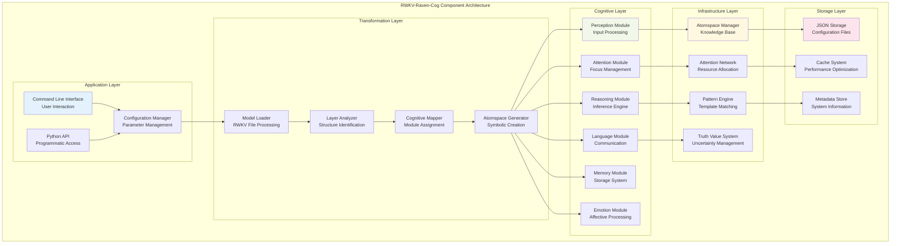

## 🧠 Cognitive Module Interactions

### Inter-Module Communication Network

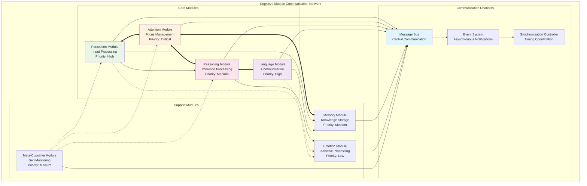

### Message Flow Patterns

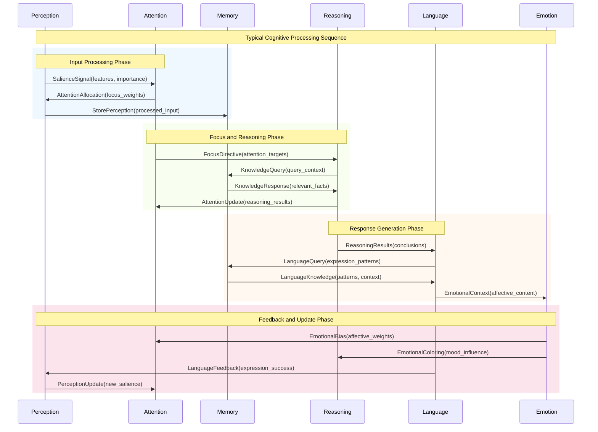

## ⚙️ Transformation Component Interactions

### Model Transformation Pipeline

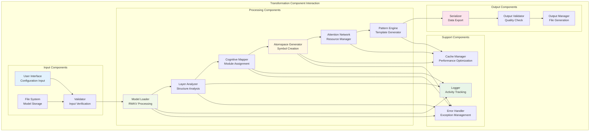

### Component Dependency Graph

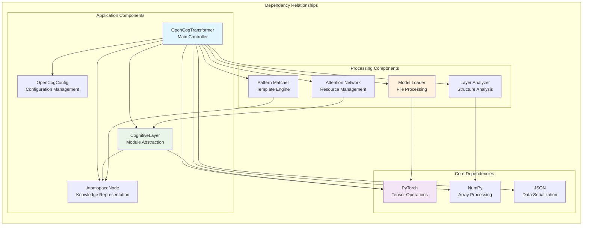

## 🔗 Data Flow Interactions

### Information Exchange Patterns

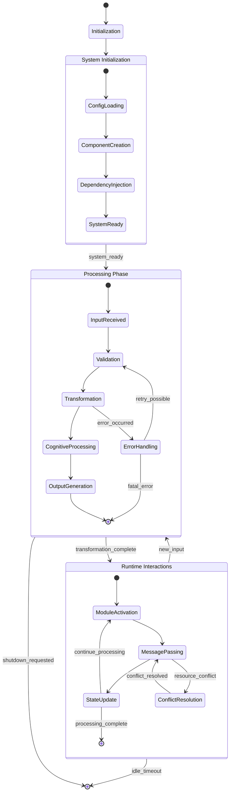

### Component Communication Protocols

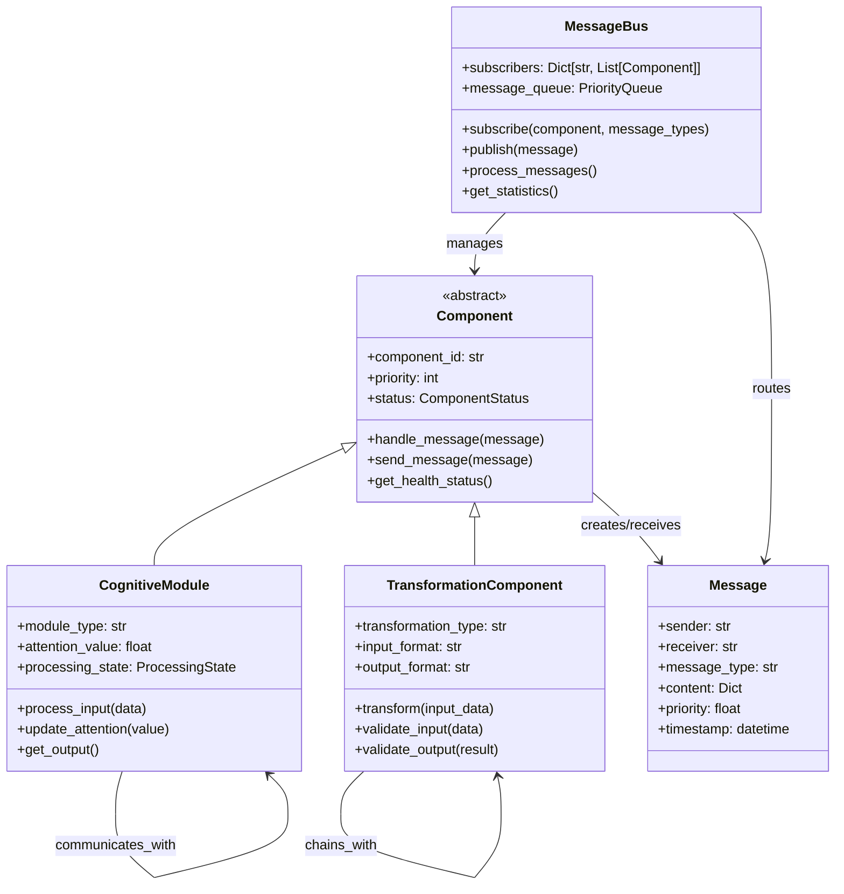

## 🎛️ Control Flow Interactions

### System Control Architecture

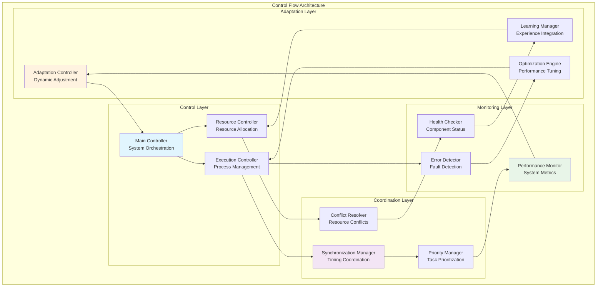

## 🔄 Feedback Loop Mechanisms

### System Feedback Architecture

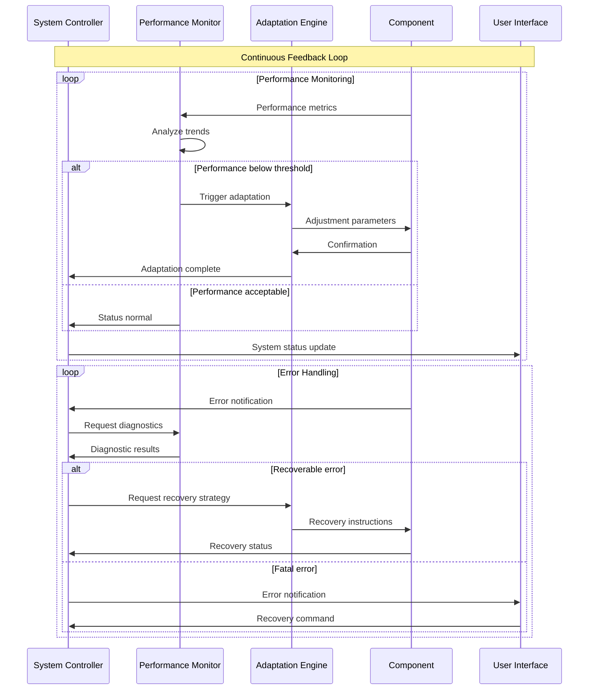

### Adaptive Behavior Patterns

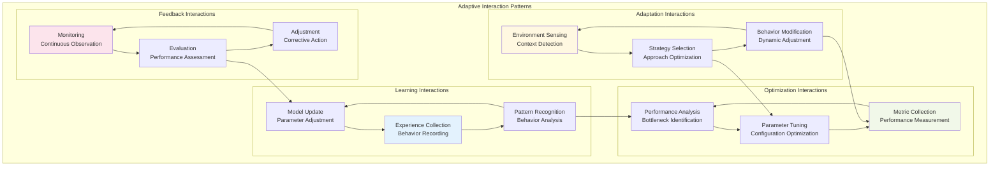

## 📊 Performance Interaction Metrics

### Component Performance Dashboard

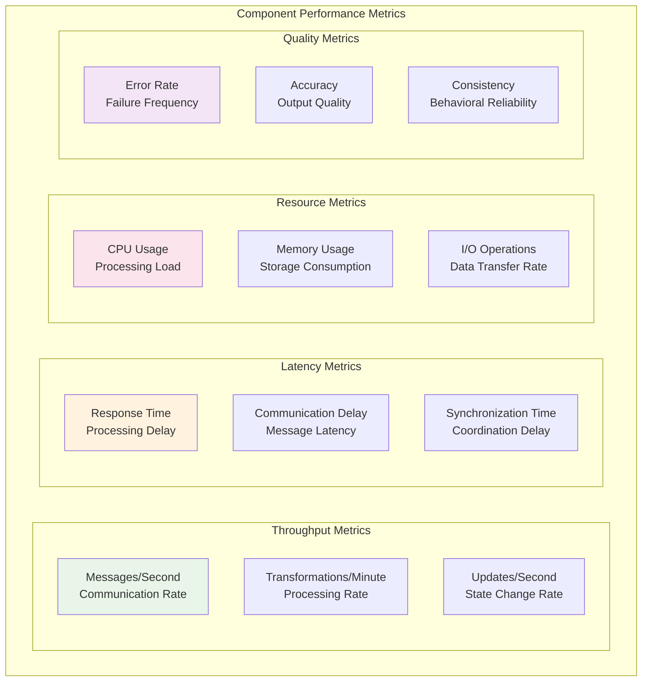

This comprehensive component interaction documentation provides a detailed understanding of how different parts of the RWKV-Raven-Cog system work together, enabling better system design, debugging, and optimization.