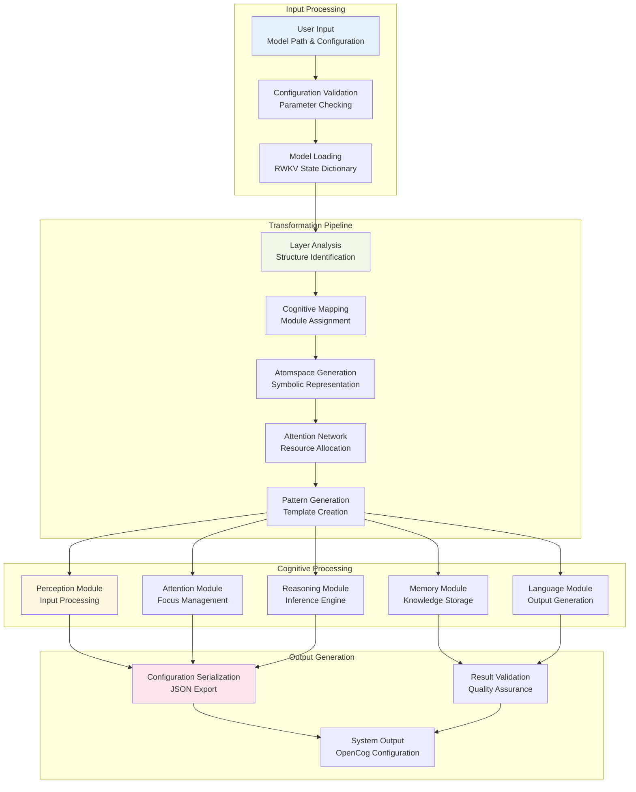
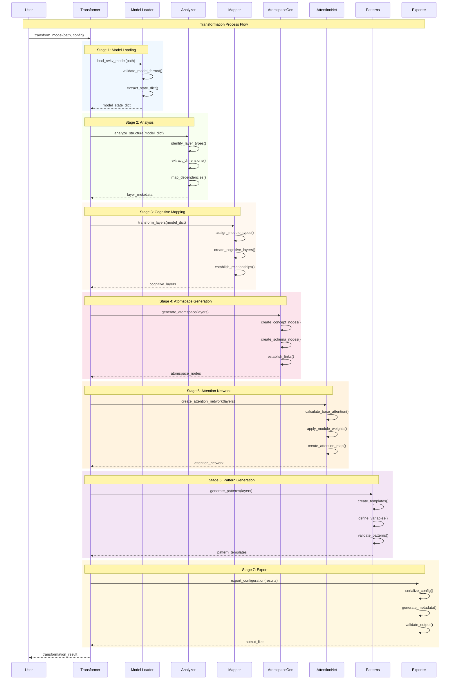
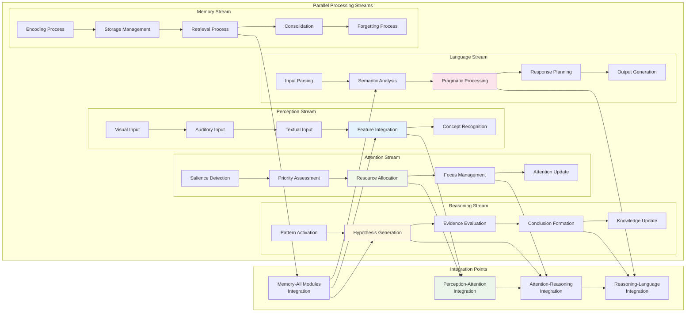
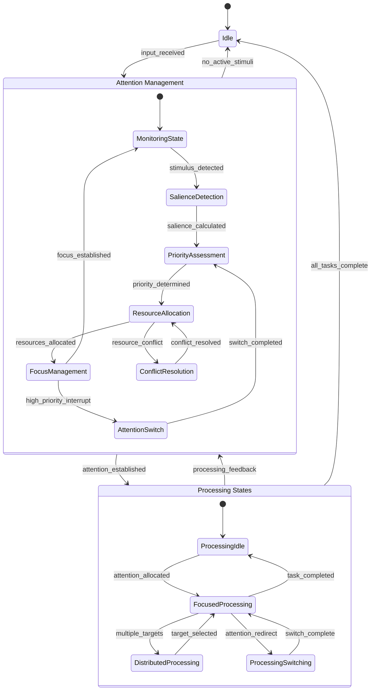
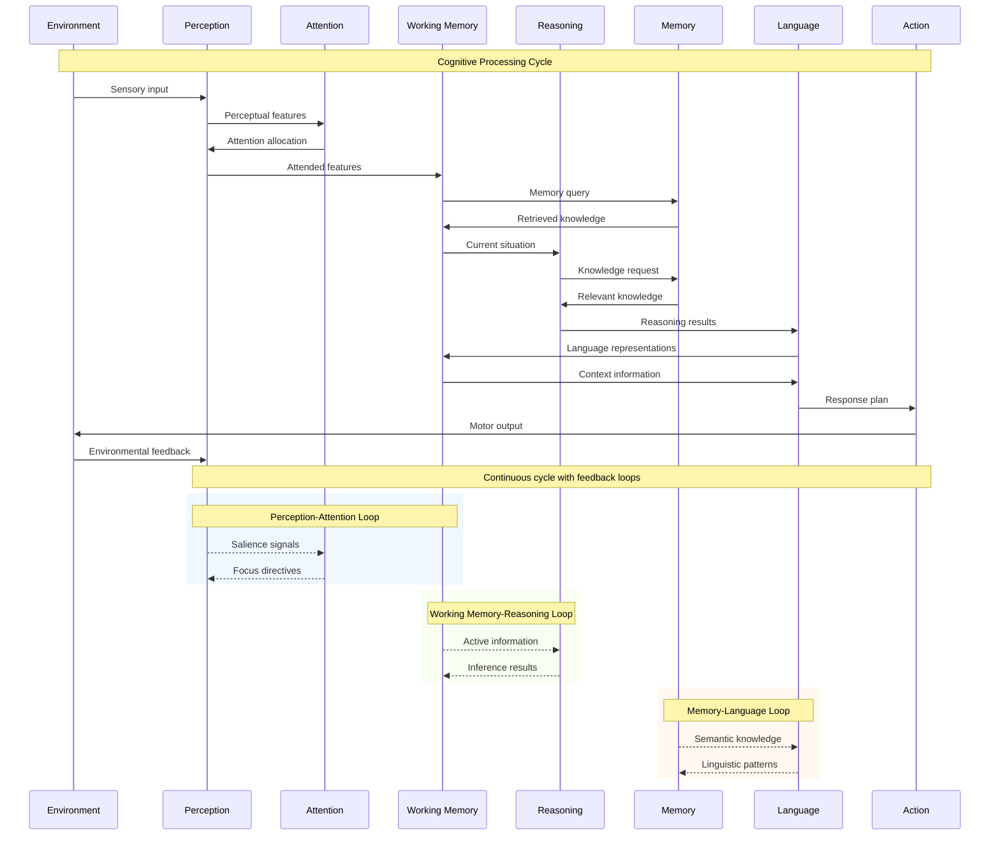
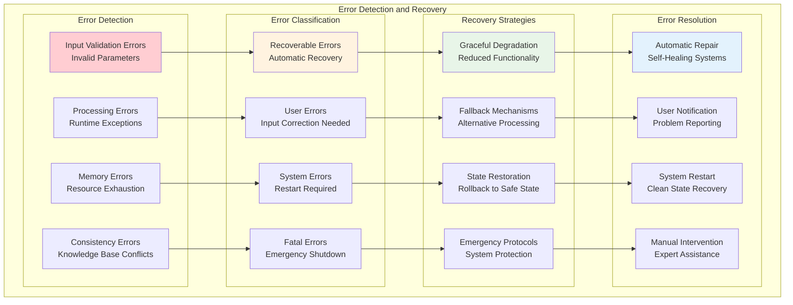
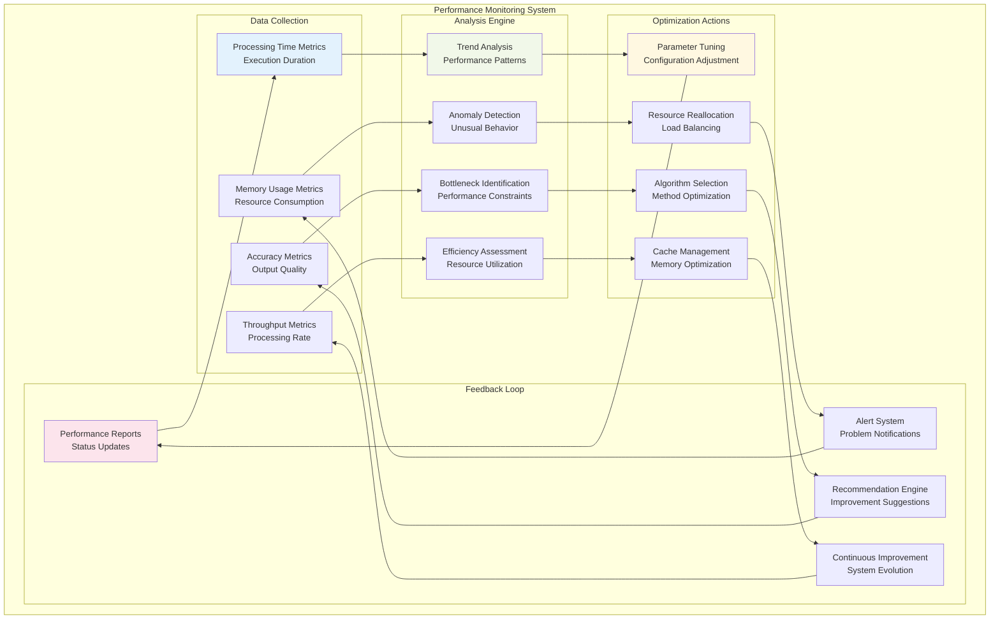

# System Flow Diagrams

This document provides comprehensive visual representations of data and control flow throughout the RWKV-Raven-Cog system, showing how information moves between components during transformation and operation.

## 🌊 High-Level System Flow

### Complete System Data Flow

## 🔄 Transformation Process Flow

### Detailed Transformation Pipeline

## 🧠 Cognitive Processing Flow

### Inter-Module Communication Flow

```mermaid
graph TD
    subgraph "Cognitive Processing Flow"
        subgraph "Input Processing Layer"
            EXT_INPUT[External Input<br/>Sensory Data]
            INPUT_BUFFER[Input Buffer<br/>Temporary Storage]
            INPUT_FILTER[Input Filter<br/>Noise Reduction]
        end
        
        subgraph "Perception Processing"
            FEATURE_EXT[Feature Extraction<br/>Pattern Detection]
            CONCEPT_FORM[Concept Formation<br/>Symbol Grounding]
            PERC_MEMORY[Perceptual Memory<br/>Recognition Patterns]
        end
        
        subgraph "Attention Processing"
            SALIENCE_DET[Salience Detection<br/>Importance Assessment]
            FOCUS_SEL[Focus Selection<br/>Target Identification]
            ATT_ALLOCATION[Attention Allocation<br/>Resource Distribution]
        end
        
        subgraph "Working Memory"
            TEMP_STORE[Temporary Storage<br/>Active Information]
            MANIPULATION[Information Manipulation<br/>Processing Operations]
            REFRESH[Memory Refresh<br/>Maintenance Cycles]
        end
        
        subgraph "Reasoning Processing"
            PATTERN_MATCH[Pattern Matching<br/>Template Application]
            INFERENCE[Logical Inference<br/>Deductive Reasoning]
            PROBLEM_SOLVE[Problem Solving<br/>Goal-Directed Search]
        end
        
        subgraph "Memory Systems"
            STM[Short-Term Memory<br/>Immediate Access]
            LTM[Long-Term Memory<br/>Persistent Storage]
            EPISODIC[Episodic Memory<br/>Experience Records]
            SEMANTIC[Semantic Memory<br/>Knowledge Base]
        end
        
        subgraph "Language Processing"
            COMPREHENSION[Language Comprehension<br/>Input Understanding]
            GENERATION[Language Generation<br/>Output Production]
            DISCOURSE[Discourse Management<br/>Conversation Context]
        end
        
        subgraph "Output Generation"
            RESPONSE_FORM[Response Formation<br/>Output Planning]
            EXECUTION[Motor Execution<br/>Action Control]
            FEEDBACK[Feedback Processing<br/>Self-Monitoring]
        end
    end
    
    EXT_INPUT --> INPUT_BUFFER
    INPUT_BUFFER --> INPUT_FILTER
    INPUT_FILTER --> FEATURE_EXT
    
    FEATURE_EXT --> CONCEPT_FORM
    CONCEPT_FORM --> PERC_MEMORY
    PERC_MEMORY --> SALIENCE_DET
    
    SALIENCE_DET --> FOCUS_SEL
    FOCUS_SEL --> ATT_ALLOCATION
    ATT_ALLOCATION --> TEMP_STORE
    
    TEMP_STORE --> MANIPULATION
    MANIPULATION --> REFRESH
    REFRESH --> PATTERN_MATCH
    
    PATTERN_MATCH --> INFERENCE
    INFERENCE --> PROBLEM_SOLVE
    PROBLEM_SOLVE --> STM
    
    STM <--> LTM
    LTM <--> EPISODIC
    LTM <--> SEMANTIC
    
    SEMANTIC --> COMPREHENSION
    COMPREHENSION --> GENERATION
    GENERATION --> DISCOURSE
    
    DISCOURSE --> RESPONSE_FORM
    RESPONSE_FORM --> EXECUTION
    EXECUTION --> FEEDBACK
    
    FEEDBACK --> ATT_ALLOCATION
    
    style EXT_INPUT fill:#e3f2fd
    style FEATURE_EXT fill:#f1f8e9
    style SALIENCE_DET fill:#fff8e1
    style TEMP_STORE fill:#fce4ec
    style PATTERN_MATCH fill:#f3e5f5
    style STM fill:#e0f2f1
    style COMPREHENSION fill:#fff3e0
    style RESPONSE_FORM fill:#ffebee
```

## 🔀 Data Flow Patterns

### Information Processing Streams

## ⚡ Real-Time Processing Flow

### Dynamic Attention Allocation

### Cognitive Cycle Flow

## 🎯 Error Handling and Recovery Flow

### Fault Tolerance Mechanisms

## 📊 Performance Monitoring Flow

### System Performance Tracking

These comprehensive flow diagrams provide detailed insights into how information, control, and processing flow through the RWKV-Raven-Cog system, enabling better understanding of system behavior and optimization opportunities.